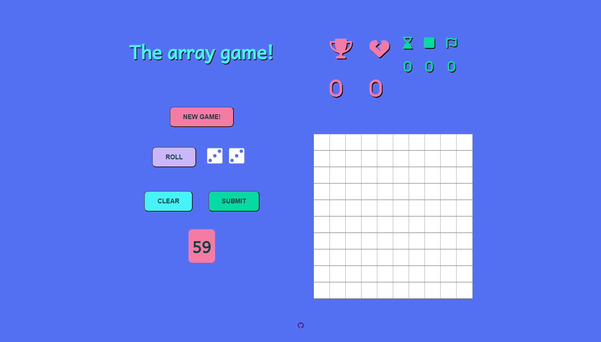
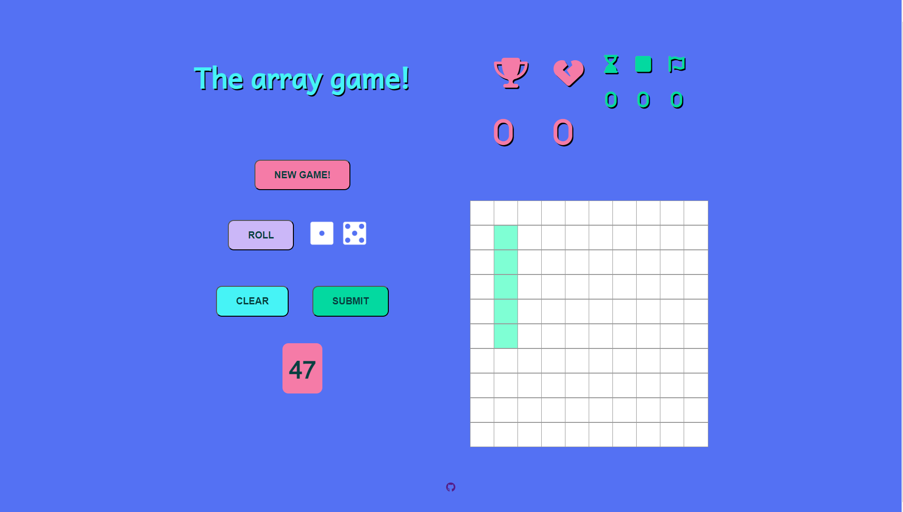
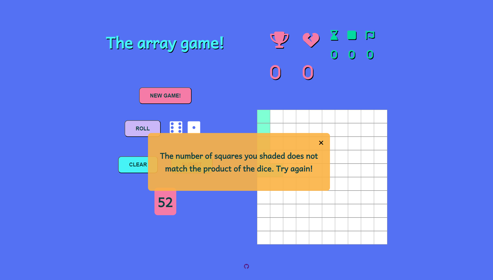
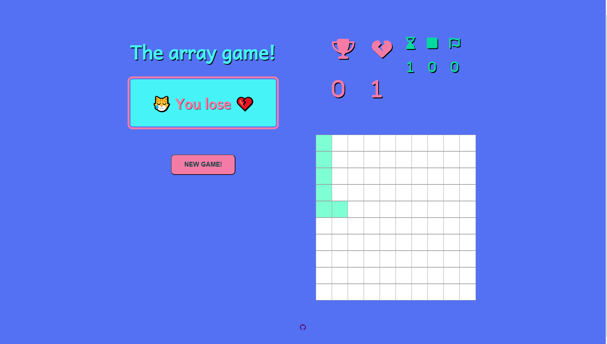
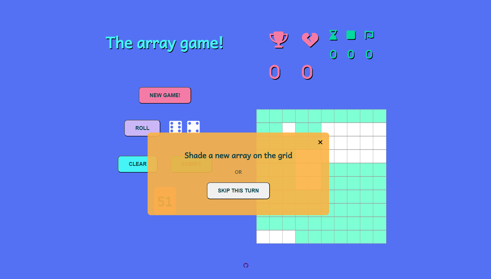
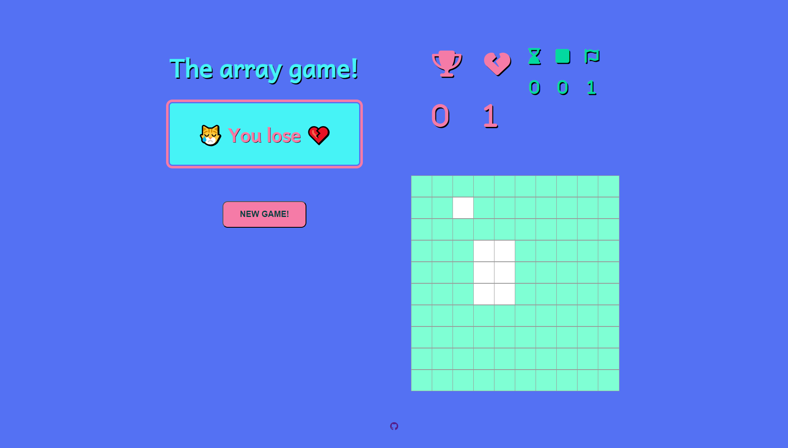
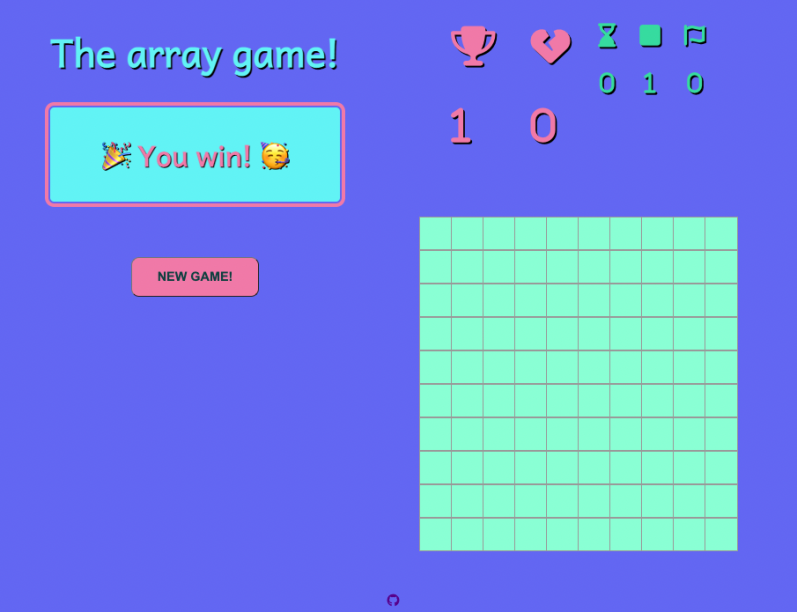

# CHINGU - VOYAGE 44

## Table of contents

- [Overview](#overview)
  - [The game](#the-game)
  - [Screenshot](#screenshot)
  - [Links](#links)
- [Our process](#our-process)
  - [Built with](#built-with)
  - [Authors](#authors)

## Overview

### The game

The Array Game is designed to help early learners build and expand on their multiplication skill for the numbers 1-6. Players use a simple grid that visually represents the calculation.
The goal of this game is to help kids supplement what they are learning about multiplication with a fun activity they use for practice.

The objective of the game is for players to shade in as much of the 10x10 grid as possible. Players take turns rolling dice and then shading an array whose dimensions are equal to the numbers on the dice.

For example, if you roll a 2 and a 3 you would shade in a 2x3 array on the grid either vertically or horizontally. In this example, the array could be either 2 rows by 3 columns or it could be 3 rows by 2 columns.

If it turns out that there's no room on the grid for your array, the player can't update the grid and must wait until their next turn to roll again.

The game will end when one of these conditions are reached:

1. A pre-defined period of time is reached. Whoever has the highest score wins.
2. A player forfeits two consecutive turns. In this situation, that player loses the game.
3. A player completely fills in their grid. This will take longer than the first two options. Depending on the luck of the roll, players may end up forfeiting many turns.

### Screenshot

      

### Links

- [Repo](https://github.com/chingu-voyages/v44-tier1-team-06)
- [Live site](https://the-array-game-mvp.vercel.app/) 

## Our process

### Built with

- JavaScript
- JQuery
- CSS3
- HTML5

### Authors
- [Carol Bruggeman](https://github.com/carolb92)
- [Amanda Libby](https://github.com/Amanda-Libby)
- [Elizabeth Roberts](https://github.com/er1927)